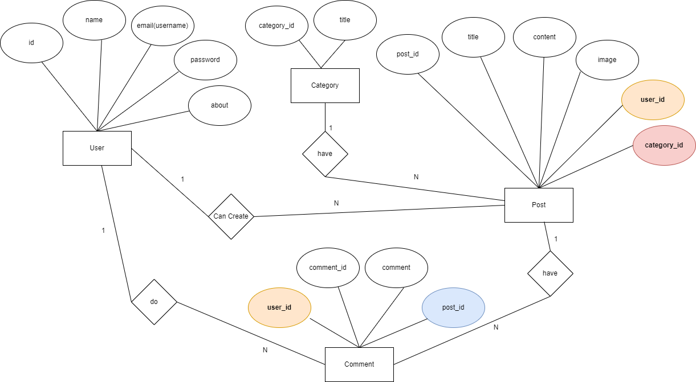

## Blog Application
* It is a web app. Where the user can create, update, delete and read posts.
* User can add, update, delete comments on posts.
* It will be a full-stack project.
* For project management and to maximize my efficiency. I will be using kanban board an agile project management tool.
* For the Mockup Design, I will be using canva.

## ER Diagram

## Tools, Framework and Language
* I am using HTML, CSS, JavaScript, React, and Bootstrap for Frontend.
* I will use Java Programming Language &  Spring Boot for REST API.
* I will be using the JUnit to test my controller method.
* I will be postman to test my Rest API.
* I will be using MYSQL Database.

## Connecting Frontend & Backend
* I will be Using Axios, a Javascript library, to communicate with the backend.
